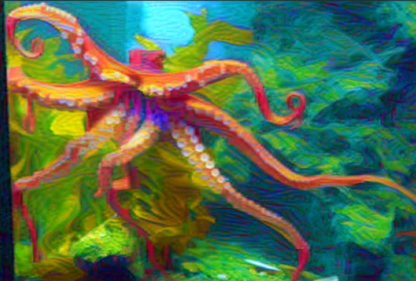

# Dashtoon Neural Style Transfer with PyTorch
This repository hosts the `dashtoon-neural-style-transfer.ipynb notebook`, showcasing the implementation of neural style transfer using PyTorch. The notebook demonstrates how to apply the artistic style of one image to another, blending them to create visually captivating results.

Here are the installation commands for each dependency, provided line by line for `dashtoon-neural-style-transfer.ipynb` notebook:

1. **PyTorch**: 
   ```bash
   pip install torch
   ```
   
2. **Torchvision**:
   ```bash
   pip install torchvision
   ```
   
3. **PIL (Python Imaging Library)**:
   ```bash
   pip install pillow
   ```

4. **Numpy**:
   ```bash
   pip install numpy
   ```

5. **Matplotlib**:
   ```bash
   pip install matplotlib
   ```

6. **Requests**:
   ```bash
   pip install requests
   ```

We can execute these commands one after the other in the terminal or command prompt to set up the environment for running your notebook. Each line installs one of the required libraries.

---

## Image Resources

The notebook utilizes a set of images stored in two folders within this repository:

- `neural_style_transfer_images1/`
- `neural_style_transfer_images2/`

These folders contain various images that can be used to perform style transfer, including but not limited to:

- Artistic styles: `hockney.jpg`, `kahlo.jpg`, `magritte.jpg`, etc.
- Content images: `cat_image_1.jpg`, `aeroplane_image_1.jpg`, `dash_toon_logo.png`, etc.

### How to Use Images

To use these images in the notebook, we can refer to them by their relative paths. Here's an example snippet of code that loads an image from the first folder:

```python
from PIL import Image

# Load an artistic style image
style_image = Image.open('neural_style_transfer_images1/hockney.jpg')
```

---
## Demonstration Example

Below is an example of how to perform neural style transfer with the images provided in this repository:

### Content Image
Here is the content image we will be using:


### Style Image
Here is the style image that we will apply to the content:


### Stylized Output
After running the style transfer process, we get the following result:




### Limitations

**Computational Intensity**
Neural style transfer is resource-intensive because it typically requires forward and backward passes through deep networks to calculate losses and update the image iteratively. When dealing with high-resolution images, the number of computations increases significantly, which can be taxing on CPUs and even GPUs. The process involves optimizing an image to reduce loss, which is a task that inherently requires significant computational power.

**Balance of Style and Content**
The core challenge in neural style transfer is to appropriately balance the influence of the content and style images. This balance is governed by weight parameters assigned to the content and style loss components. If the style weight is too high, the generated image may over-emphasize textures and colors of the style image at the expense of the recognizable features of the content image. Conversely, if the content weight is too high, the generated image may not exhibit the desired artistic style.

**Generalization**
Neural style transfer models are often trained on a specific set of images or styles and may not generalize well to new, unseen combinations of styles and contents. The style transfer might work well for similar kinds of images to those seen during training but may fail to produce quality results on vastly different images. The transfer is particularly challenging when the style image has very abstract features that are not easily captured by the loss functions.

### Potential Improvements

**Efficient Networks**
One way to address computational demands is to use more efficient network architectures that require fewer operations per forward and backward pass. Lightweight versions of deep networks, network pruning, or quantization can help reduce the computational load without significantly compromising the quality of the style transfer.

**User Control**
Developing an interface that allows users to easily adjust the style and content weights can significantly enhance the usability of neural style transfer. This could be extended to include interactive features, allowing users to see real-time previews of how changes in parameters affect the output.

**Adaptive Loss Functions**
Advanced loss functions that can adapt the balance between content and style dynamically during the optimization process could provide better results. These adaptive functions might employ additional constraints or regularization terms that preserve content integrity while incorporating style or even use reinforcement learning techniques to adjust parameters on the fly.

**Stylization Strength**
A parameter that controls the overall strength of stylization could allow users to dial the effect up or down, much like adjusting the opacity of a layer in graphics software. This could be implemented as an overall multiplier to the style loss or as a more sophisticated function that adjusts the style representation itself.

**Real-time Processing**
For applications like video processing or augmented reality, real-time style transfer is desirable. This might involve simplified models, network distillation, or specialized hardware accelerators. Researchers are also exploring fast approximations of neural style transfer that can run in real-time on less powerful devices.

### Loss Functions in Neural Style Transfer

The loss function in neural style transfer typically consists of three components:

1. **Content Loss**: Usually, the squared error between feature representations of the content image and the generated image within certain layers of the network. These layers are often chosen from the middle of the network to capture high-level content without focusing on the exact pixel values.

2. **Style Loss**: This is more complex and involves comparing the Gram matrices (which capture the correlations between different filter responses) of the style image and the generated image. The layers chosen for style representation are usually earlier in the network, where texture and color information are captured.

3. **Total Variation Loss**: Sometimes included to encourage spatial smoothness in the generated image.

Researchers have proposed variations and extensions of these loss functions, such as:

- **Perceptual Loss**: Measures perceptual differences between images using deep feature spaces.
- **Semantic Content Loss**: Incorporates semantic understanding by segmenting the image into meaningful regions and treating them differently.
- **Feature Reconstruction Loss**: Encourages the generated image to closely match the feature responses of the content image.

